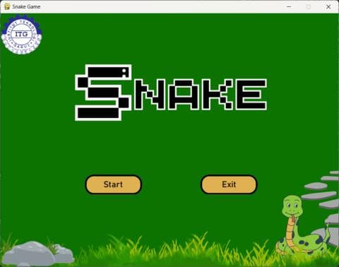
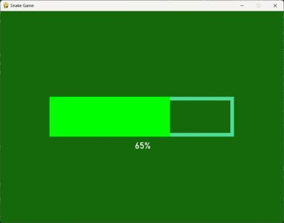
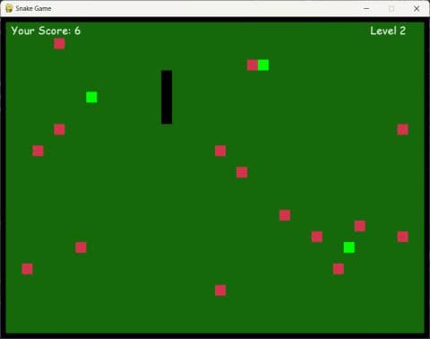
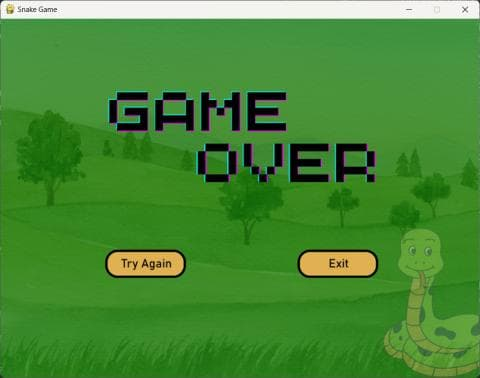

# Snake Game — Tugas Besar Praktikum Algoritma dan Struktur Data

Game Snake yang mengimplementasikan struktur data **Stack** pada mekanik ular (push saat makan makanan, pop saat menabrak jebakan). Tersedia versi desktop (Python + Pygame) dan versi web (HTML5 Canvas + JavaScript).

## Demo

> Mainkan langsung di browser: **[Play Now](https://rhizu05.github.io/Snake-Game-py)**
>
> _(Link itch.io: `https://<username>.itch.io/snake-game`)_

---

## Tampilan Game

| Menu Utama | Loading | Gameplay | Game Over |
|---|---|---|---|
|  |  |  |  |

---

## Cara Bermain

| Tombol | Aksi |
|---|---|
| `↑` | Gerak ke atas |
| `↓` | Gerak ke bawah |
| `←` | Gerak ke kiri |
| `→` | Gerak ke kanan |

**Aturan:**
- Makan kotak **hijau** → ular bertambah panjang, skor +1
- Makan kotak **merah** (jebakan) → ular berkurang panjang
- Ular mati jika menabrak dinding, tubuh sendiri, atau panjang habis karena jebakan
- Setiap kelipatan 5 skor, level naik dan kecepatan bertambah

---

## Konsep Algoritma dan Struktur Data

Game ini mengimplementasikan **Stack (Tumpukan)**:

- **Push** — saat ular memakan makanan, segmen baru ditambahkan ke belakang (`snake_List.append`)
- **Pop** — saat ular menabrak jebakan, segmen paling depan dihapus (`snake_List.pop(0)`)
- **Overflow check** — jika panjang ular menjadi 0 setelah pop, game over

---

## Menjalankan Secara Lokal

### Versi Web (browser)
Buka `index.html` di browser, atau jalankan server lokal:

```bash
python -m http.server
# buka http://localhost:8000
```

### Versi Desktop (Python)

#### Prasyarat
- Python 3.10+
- pip

#### Langkah

```bash
# Clone repo
git clone https://github.com/[username]/[repo-name].git
cd [repo-name]

# Install dependensi
pip install pygame

# Jalankan game
python main.py
```

---

## Tech Stack

- **Python 3** — bahasa pemrograman utama (versi desktop)
- **Pygame** — library game desktop
- **HTML5 Canvas + JavaScript** — versi web (tanpa dependency, berjalan di browser)

---

## Tim Pengembang

| Nama | NIM | Peran |
|---|---|---|
| Muhamad Rijki Nurjakiah | 2306044 | Project Manager |
| Muhamad Ar Rasyid Rizki Oktavian | 2306045 | Programmer |
| Moh. Ramdani | 2306062 | Assets |

---

## Lisensi

Project ini dibuat untuk keperluan akademik — **Praktikum Algoritma dan Struktur Data**, Institut Teknologi Garut.
